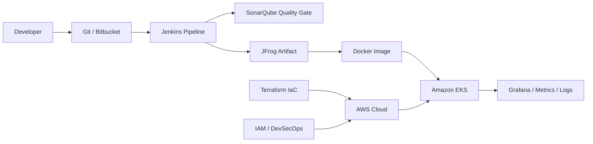
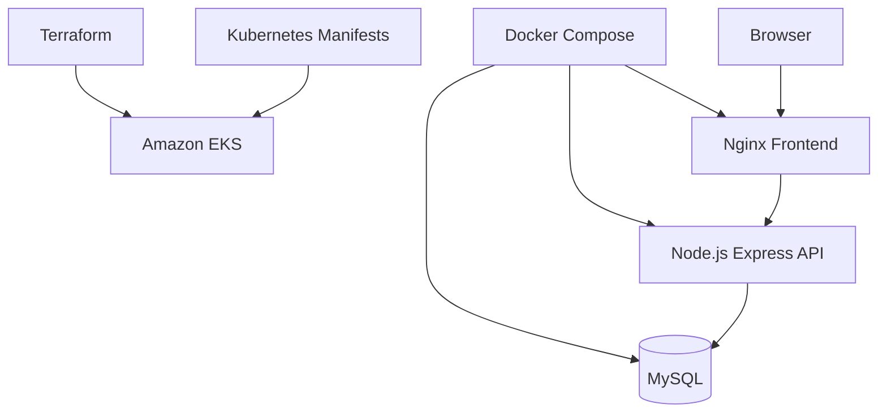

<p align="center">
  
</p>

<h1 align="center">
  
</h1>

<p align="center">
  <a href="https://github.com/saifali1035">
    
  </a>
  <a href="https://www.linkedin.com/in/saif--ali/" target="_blank">
    
  </a>
  <a href="mailto:saifaliali1035@gmail.com">
    
  </a>
  
</p>

<p align="center">
  
  
  
  
  
</p>

---

## Mission Control

<p align="center">
  
</p>

<table>
  <tr>
    <td width="33%" align="center">
      
      <br /><br />
      Developer platforms, reusable workflows, self-service delivery, cloud reliability.
    </td>
    <td width="33%" align="center">
      
      <br /><br />
      VPC, EC2, IAM, S3, Load Balancers, Auto Scaling, Lambda, EKS.
    </td>
    <td width="33%" align="center">
      
      <br /><br />
      Docker, EKS, services, ingress, deployments, rollout troubleshooting.
    </td>
  </tr>
</table>

```yaml
name: Saif Ali
role: Senior Platform Engineer
location: India
current: CBA
previous: Volkswagen, Cognizant, Wipro
core_stack: AWS, EKS, Kubernetes, Docker, Terraform, Jenkins, Linux, Ansible
focus: Platform Engineering, DevSecOps, Observability, GitOps, FinOps
```

<p align="center">
  
  
  
</p>

---

## Cloud-Native Flow



<details>
  <summary><b>Open my platform engineering playbook</b></summary>
  <br />

| Layer | What I Build / Improve |
| --- | --- |
| Cloud Foundation | AWS networking, IAM, compute, storage, scaling |
| Delivery | Jenkins pipelines, shared libraries, reusable build patterns |
| Runtime | Docker, Kubernetes, Amazon EKS, Nginx, rollout support |
| Quality | SonarQube checks, versioned artifacts, controlled releases |
| Automation | Terraform, Ansible, Shell scripting, repeatable operations |
| Reliability | Logs, metrics, alerts, troubleshooting, platform hardening |
| Modern Focus | GitOps, DevSecOps, Observability, FinOps, AI-ready operations |

</details>

---

## Career Map

<table>
  <tr>
    <td><b>2025 - Present</b></td>
    <td><b>CBA</b></td>
    <td>Senior Platform Engineer</td>
  </tr>
  <tr>
    <td><b>2024 - 2025</b></td>
    <td><b>Volkswagen</b></td>
    <td>Senior AWS DevOps Engineer</td>
  </tr>
  <tr>
    <td><b>2022 - 2024</b></td>
    <td><b>Cognizant</b></td>
    <td>AWS DevOps / Cloud Infrastructure</td>
  </tr>
  <tr>
    <td><b>2018 - 2022</b></td>
    <td><b>Wipro</b></td>
    <td>Linux, Infrastructure, DevOps Automation</td>
  </tr>
</table>

<details open>
  <summary><b>CBA and Volkswagen highlights</b></summary>
  <br />

| Organization | Highlights |
| --- | --- |
| CBA | Platform engineering, developer experience, cloud-native workloads, reusable workflows, operational reliability |
| Volkswagen | AWS infrastructure, EKS, Docker, CI/CD pipelines, release troubleshooting, automation and standardization |

</details>

<details>
  <summary><b>Cognizant and Wipro experience</b></summary>
  <br />

| Organization | Highlights |
| --- | --- |
| Cognizant | AWS VPC, subnets, NAT, Security Groups, NACLs, EC2, ASG, S3, Lambda, EKS, Jenkins, SonarQube, JFrog, Ansible |
| Wipro | AIX, HPUX, RHEL, Ubuntu, CentOS, Shell scripting, DB2, Oracle, AWS infrastructure, Jenkins, Git, Bitbucket |

</details>

---

## Tech Arsenal

<p align="center">
  
</p>

<p align="center">
  
  
  
</p>

<table>
  <tr>
    <td align="center" width="25%"><b>Cloud</b><br />AWS, EKS, VPC, IAM, EC2, S3, Lambda</td>
    <td align="center" width="25%"><b>Delivery</b><br />Jenkins, Docker, JFrog, SonarQube</td>
    <td align="center" width="25%"><b>Automation</b><br />Terraform, Ansible, Shell, Linux</td>
    <td align="center" width="25%"><b>Reliability</b><br />Grafana, Prometheus, Logs, Metrics</td>
  </tr>
</table>

---

## Featured Builds

<table>
  <tr>
    <td width="50%">
      <h3>Three-Tier App on Docker and Kubernetes</h3>
      <p>Nginx frontend, Node.js/Express backend, MySQL database, Docker Compose, Kubernetes manifests, and Terraform-backed EKS infrastructure.</p>
      <p>
        
        
        
        
      </p>
    </td>
    <td width="50%">
      <h3>Docker Getting Started App</h3>
      <p>Node.js app cleanup, ESM/CommonJS package fix, production Dockerfile alignment, and container runtime improvements.</p>
      <p>
        
        
        
      </p>
    </td>
  </tr>
</table>

<details>
  <summary><b>Open project architecture</b></summary>
  <br />



</details>

---

## Market Signal

<table>
  <tr>
    <td align="center"><b>Platform Engineering</b><br />Internal platforms, golden paths, reusable workflows</td>
    <td align="center"><b>DevSecOps</b><br />IAM, image security, quality gates, secure delivery</td>
    <td align="center"><b>Observability</b><br />Metrics, logs, alerts, Grafana, Prometheus, OpenTelemetry</td>
  </tr>
  <tr>
    <td align="center"><b>GitOps</b><br />Declarative delivery and environment consistency</td>
    <td align="center"><b>FinOps</b><br />Right-sizing, scaling, cost visibility, waste reduction</td>
    <td align="center"><b>AI-Ready Ops</b><br />Automation-friendly cloud workflows and smarter troubleshooting</td>
  </tr>
</table>

---

## GitHub Pulse

<div align="center">
  
  <br /><br />
  
  
  
  <br /><br />
  
  
  <br /><br />
  
</div>

---

## Connect

<p align="center">
  <a href="https://www.linkedin.com/in/saif--ali/" target="_blank">
    
  </a>
  <a href="mailto:saifaliali1035@gmail.com">
    
  </a>
  <a href="https://www.instagram.com/_.saif.ali_/" target="_blank">
    
  </a>
</p>

<p align="center">
  
</p>
