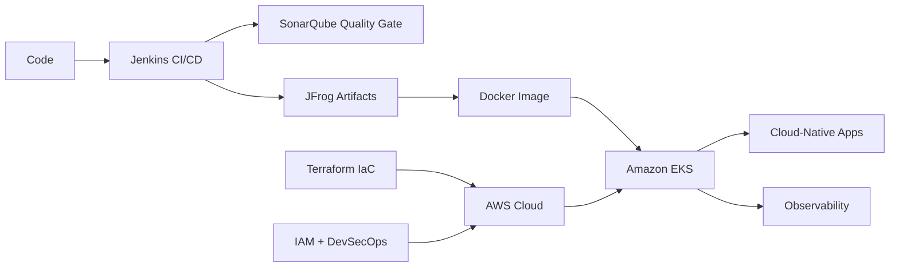
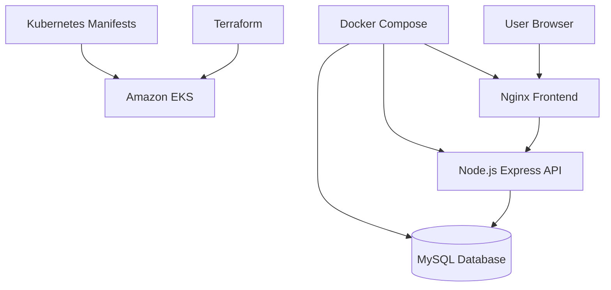

<h1 align="center">
  
</h1>

<h3 align="center">Senior Platform Engineer | AWS DevOps | Kubernetes | Terraform | CI/CD | Cloud Automation</h3>

  

  
  
  
  

  
  
  
  
  

---

## About Me

I am a passionate DevOps and Platform Engineer from India, focused on building reliable, automated, and scalable cloud platforms.

- Currently working as **Senior Platform Engineer at CBA**
- Previously worked with **Volkswagen, Cognizant, and Wipro**
- Strong hands-on experience across **AWS, EKS, Kubernetes, Docker, Terraform, Jenkins, Linux, Shell Scripting, Ansible, SonarQube, JFrog, and Git**
- Comfortable designing cloud infrastructure, automating deployments, managing CI/CD pipelines, and improving platform reliability
- Projects: [github.com/saifali1035](https://github.com/saifali1035)
- Reach me: **saifaliali1035@gmail.com**

---

## DevOps Command Center

| Current Mission | Core Strength | Engineering Style |
| --- | --- | --- |
| Building reliable cloud platforms | AWS, EKS, Kubernetes, Terraform, CI/CD | Automate first, measure always, improve continuously |

  
<b>Click to see what I am focused on right now</b>

   

- Building stronger **platform engineering** foundations for developer self-service
- Improving **Kubernetes and EKS** deployment workflows
- Practicing **Terraform-first infrastructure design**
- Strengthening **DevSecOps**, IAM, image security, and policy-driven delivery
- Learning deeper **observability**, SLOs, OpenTelemetry, Grafana, and Prometheus patterns
- Keeping cloud platforms cost-aware with practical **FinOps** thinking

  
<b>Click to see my DevOps operating model</b>

   

| Layer | What I Focus On |
| --- | --- |
| Source | Git, Bitbucket, branching strategy, pull request flow |
| Build | Jenkins pipelines, reusable shared libraries, Dockerized build agents |
| Quality | SonarQube checks, repeatable validation, secure code flow |
| Artifact | JFrog repositories, versioned artifacts, traceable releases |
| Deploy | Kubernetes, EKS, manifests, services, ingress, rollout troubleshooting |
| Operate | Linux, logs, metrics, alerts, reliability improvements |
| Automate | Terraform, Ansible, Shell scripting, reusable infrastructure patterns |

---

## Career Timeline

| Period | Organization | Role / Focus |
| --- | --- | --- |
| 2025 - Present | **CBA** | Senior Platform Engineer |
| 2024 - 2025 | **Volkswagen** | Senior AWS DevOps Engineer |
| 2022 - 2024 | **Cognizant** | AWS DevOps / Cloud Infrastructure |
| 2018 - 2022 | **Wipro** | Linux, Infrastructure, DevOps Automation |

---

## Professional Experience

  
<b>CBA | Senior Platform Engineer</b>

   

### CBA | Senior Platform Engineer

- Working on platform engineering practices that improve developer experience, deployment reliability, and operational efficiency.
- Supporting cloud-native workloads with automation-first practices across CI/CD, infrastructure, and runtime operations.
- Building reusable workflows and platform capabilities for engineering teams.
- Applying modern DevOps practices around reliability, observability, security, and continuous improvement.

  
<b>Volkswagen | Senior AWS DevOps Engineer | 2024 - 2025</b>

   

### Volkswagen | Senior AWS DevOps Engineer | 2024 - 2025

- Designed, automated, and supported AWS cloud infrastructure for scalable and reliable application environments.
- Worked with core AWS services including **VPC, EC2, IAM, S3, Load Balancers, Auto Scaling, Lambda, and EKS**.
- Built and maintained CI/CD pipelines for application build, test, artifact, and deployment workflows.
- Containerized application components using Docker and supported Kubernetes-based deployments.
- Improved infrastructure consistency using automation, scripting, reusable pipeline logic, and environment standardization.
- Collaborated with development and operations teams to troubleshoot deployment issues, improve release flow, and strengthen cloud reliability.

  
<b>Cognizant | AWS DevOps / Cloud Infrastructure | 2022 - 2024</b>

   

### Cognizant | AWS DevOps / Cloud Infrastructure | 2022 - 2024

- Designed AWS infrastructure using **VPCs, subnets, NAT gateways, security groups, NACLs, EC2, Auto Scaling Groups, S3, Lambda, and Load Balancers**.
- Managed secure access patterns with **IAM users, roles, and policies**.
- Specialized in container management and orchestration using **Amazon EKS**.
- Built Jenkins declarative pipelines using shared libraries for reusable and maintainable CI/CD workflows.
- Integrated custom Docker images into Jenkins pipelines for consistent and reproducible builds.
- Managed project-specific Jenkins agents and deployment environments.
- Used **Git, Bitbucket, SonarQube, and JFrog** for source control, code quality, and artifact management.
- Automated repeatable tasks using **Shell scripting, Linux tooling, and Ansible**.

  
<b>Wipro | Linux / Infrastructure / DevOps Automation | 2018 - 2022</b>

   

### Wipro | Linux / Infrastructure / DevOps Automation | 2018 - 2022

- Worked across Linux and Unix environments including **AIX, HPUX, RHEL, Ubuntu, and CentOS**.
- Automated operational tasks using Shell scripting and Linux administration practices.
- Administered and supported **DB2 and Oracle** database environments.
- Supported AWS infrastructure components including **VPC, EC2, S3, Load Balancing, NAT gateways, Auto Scaling, and Lambda**.
- Built Jenkins pipelines and managed CI/CD automation workflows.
- Used **Git, Bitbucket, SonarQube, and JFrog** for source control, quality checks, and artifact distribution.
- Focused on reliability, process improvement, and continuous learning across DevOps practices.

---

## Market-Ready DevOps Focus

Modern DevOps is moving toward platform engineering, secure automation, intelligent operations, and cloud cost awareness. These are the areas I actively focus on:

- **Platform Engineering:** Internal developer platforms, reusable templates, self-service workflows, golden paths
- **Cloud Native:** Kubernetes, Amazon EKS, containerized workloads, service discovery, ingress, scaling
- **GitOps:** Argo CD / Flux-style deployment models, declarative environments, pull-based delivery
- **Infrastructure as Code:** Terraform, reusable modules, environment consistency, drift reduction
- **DevSecOps:** IAM hardening, image scanning, policy as code, secrets management, secure CI/CD
- **Observability:** Prometheus, Grafana, logs, metrics, alerts, SLO-focused monitoring, OpenTelemetry practices
- **FinOps:** Cloud cost visibility, right-sizing, scaling policies, waste reduction
- **AI-Ready Operations:** Automation, intelligent troubleshooting, cloud workflows that support modern AI-enabled delivery

---

## Tech Stack

### Cloud and Platform

  
  
  
  
  

### Infrastructure and Automation

  
  
  
  

### CI/CD and DevOps

  
  
  
  
  

### Databases and Development

  
  
  
  
  
  

---

## Featured Work

### Three-Tier Application on Docker and Kubernetes

- Built a three-tier app with **Nginx frontend, Node.js/Express backend, and MySQL database**
- Containerized all services with Docker
- Added Kubernetes manifests for frontend, backend, database services, deployments, and ingress
- Created Terraform infrastructure for **Amazon EKS in Mumbai**
- Practiced production-style concepts including service discovery, container networking, persistent database setup, and cloud deployment structure

### Docker Getting Started Application

- Worked with a Node.js application serving static frontend assets and API routes
- Fixed package compatibility issues around ESM/CommonJS dependencies
- Updated Dockerfile to match the actual Node.js runtime model
- Improved container build flow for a production-style Express app

  
<b>Click to view project architecture highlights</b>

   

---

## What I Bring

- Strong troubleshooting mindset across application, infrastructure, CI/CD, and runtime layers
- Ability to connect development workflows with platform reliability
- Hands-on cloud experience with AWS and Kubernetes-based deployments
- Automation-first approach using scripts, pipelines, IaC, and reusable patterns
- Practical understanding of enterprise environments, access control, release flow, and operational support

---

## Connect With Me

  
  
  

---

## GitHub Stats

  
   
   
  
  
   
  
   
   
  

---

  <strong>Cloud is not just infrastructure. It is reliability, automation, security, and developer speed working together.</strong>

